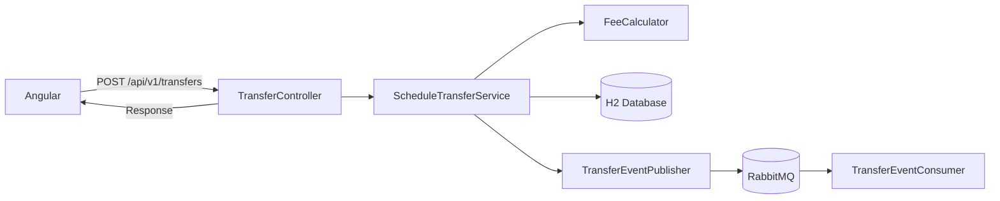
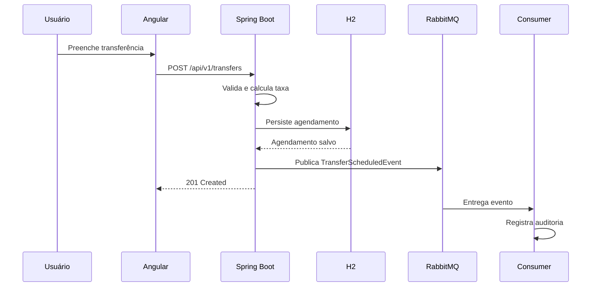

# Scheduled Transfer

Sistema de agendamento de transferências financeiras: o usuário agenda uma transferência informando conta de origem, conta de destino, valor e data da transferência. O sistema calcula automaticamente a taxa aplicável, rejeita agendamentos sem taxa aplicável, persiste o agendamento e permite consultar o extrato de tudo que foi agendado.

## Sobre o projeto

Este projeto foi desenvolvido como avaliação técnica para Wayon. Além de atender ao escopo pedido, ele foi usado como oportunidade para demonstrar as tecnologias exigidas pela vaga (Spring Boot, Spring Data JPA, RabbitMQ, Angular) sem introduzir complexidade artificial. Cada peça técnica (mensageria, observabilidade, Docker) tem uma justificativa concreta, documentada abaixo em [Decisões arquiteturais](#decisões-arquiteturais).

## Requisitos funcionais

- Cadastrar um agendamento de transferência: conta de origem (10 dígitos), conta de destino (10 dígitos), valor, data da transferência.
- Data de agendamento é sempre a data atual do servidor.
- Cálculo automático da taxa conforme a tabela abaixo.
- Rejeição de agendamentos fora da janela de taxa aplicável (mensagem de erro clara).
- Listagem de todos os agendamentos cadastrados (extrato).
- Persistência em banco de dados em memória (H2).
- Mensagens de erro e sucesso exibidas no front-end.

## Tecnologias utilizadas

| Camada | Tecnologia |
|---|---|
| Backend | Java 11, Spring Boot 2.7.18, Spring Data JPA, Bean Validation, Spring AMQP |
| Persistência | H2 (em memória) |
| Mensageria | RabbitMQ |
| Observabilidade | Spring Boot Actuator, SLF4J/Logback, correlation ID |
| Documentação de API | springdoc-openapi (Swagger UI) |
| Frontend | Angular 22 (standalone components, signals), Bootstrap 5 |
| Containerização | Docker, Docker Compose |
| Testes | JUnit 5, AssertJ, Mockito (backend) · Vitest (frontend) |

## Arquitetura

Monólito modular, com o backend organizado por responsabilidade:

```text
backend/src/main/java/com/renato/transfer/
├── application/
│   ├── dto/            # CreateTransferRequest, TransferResponse
│   └── service/         # ScheduleTransferService, ListTransfersService
├── domain/
│   ├── model/            # TransferSchedule (entidade JPA), TransferStatus
│   └── service/          # FeeCalculator, DefaultFeeCalculator
├── infrastructure/
│   ├── persistence/      # TransferScheduleRepository
│   ├── messaging/        # RabbitMqConfiguration, TransferEventPublisher/Consumer
│   └── observability/    # CorrelationIdFilter, AccountMasker
├── interfaces/
│   └── rest/              # TransferController, GlobalExceptionHandler
└── exception/             # FeeNotApplicableException, ErrorResponse
```

O frontend segue a mesma lógica de separação por feature:

```text
frontend/src/app/
├── core/
│   └── interceptors/      # correlation-id.interceptor.ts
└── features/
    └── transfers/
        ├── models/         # transfer.model.ts
        ├── services/       # transfer-api.ts
        ├── components/     # transfer-form/ (validação), transfer-list/ (tabela)
        └── pages/          # transfer-schedule-page/ (orquestra tudo)
```

### Diagrama de componentes



### Diagrama de sequência



## Fluxo de agendamento

O fluxo de criação é **síncrono**, o Angular só recebe a resposta depois que a taxa é calculada e o agendamento é persistido. O RabbitMQ entra **depois** disso, apenas para um efeito colateral (auditoria assíncrona), ele nunca participa do cálculo de taxa, da persistência, da consulta do extrato ou da comunicação Angular↔backend.

## Regra de cálculo da taxa

Isolada em `FeeCalculator`/`DefaultFeeCalculator`, calculada a partir da diferença em dias corridos entre a data de agendamento e a data da transferência:

| Dias | Valor fixo | Percentual |
|---|---|---|
| 0 | R$ 3,00 | 2,5% |
| 1 a 10 | R$ 12,00 | 0,0% |
| 11 a 20 | R$ 0,00 | 8,2% |
| 21 a 30 | R$ 0,00 | 6,9% |
| 31 a 40 | R$ 0,00 | 4,7% |
| 41 a 50 | R$ 0,00 | 1,7% |

Fora dessa janela (data anterior a hoje ou mais de 50 dias no futuro), a API rejeita o agendamento com `FEE_NOT_APPLICABLE`. Coberta por 14 testes parametrizados cobrindo todas as faixas, os dois limites de rejeição e arredondamento.

## Mensageria

Após a persistência, `TransferEventPublisher` publica um `TransferScheduledEvent` no exchange `transfer.events` (routing key `transfer.scheduled`), consumido por `TransferEventConsumer` na fila `transfer.scheduled.audit` (com DLQ `transfer.scheduled.audit.dlq` via dead-lettering) para simular um processamento de auditoria.

Falha na publicação é logada, não propagada. O agendamento já foi persistido nesse ponto, então o usuário continua recebendo uma resposta de sucesso. Essa limitação é intencional, veja [Limitações conhecidas](#limitações-conhecidas).

## Observabilidade

- **Correlation ID**: `CorrelationIdFilter` reaproveita o header `X-Correlation-Id` recebido (ou gera um novo) e o injeta no MDC do SLF4J. Toda linha de log de uma requisição, do controller ao consumer do RabbitMQ, carrega o mesmo identificador.
- **Logs mascarados**: números de conta aparecem como `******7890` nos logs (`AccountMasker`), nunca completos.
- **Actuator**: apenas `health`, `info` e `metrics` expostos (não o conjunto completo de endpoints).
- **Swagger/OpenAPI**: `/swagger-ui/index.html` e `/v3/api-docs`.

## Como executar localmente

Pré-requisitos: Java 11, Node 20+, RabbitMQ rodando em `localhost:5672` (pode ser via `docker run -p 5672:5672 -p 15672:15672 rabbitmq:3-management`).

```bash
# Backend (usa o Java 11 fixado em backend/.sdkmanrc, se você usa sdkman)
cd backend
./mvnw spring-boot:run
```

```bash
# Frontend, em outro terminal
cd frontend
npm install
npx ng serve --proxy-config proxy.conf.json
```

Acesse `http://localhost:4200`. O proxy do Angular encaminha `/api/*` para `localhost:8080`.

## Como executar com Docker

```bash
docker compose up --build
```

Isso sobe RabbitMQ, backend e frontend (servido via Nginx, que também faz proxy reverso de `/api/*` para o backend). Acesse `http://localhost:4200`.

## Endpoints

| Método | Rota | Descrição |
|---|---|---|
| POST | `/api/v1/transfers` | Agenda uma transferência |
| GET | `/api/v1/transfers` | Lista todos os agendamentos (ordenado por data de agendamento e id, decrescente) |
| GET | `/actuator/health` | Health check |
| GET | `/swagger-ui/index.html` | Documentação interativa da API |
| GET | `/h2-console` | Console do H2 (JDBC URL: `jdbc:h2:mem:transferdb`, usuário `sa`, sem senha) |

## Testes

- **Backend**: 30 testes (JUnit 5 + AssertJ + Mockito) - regra de taxa (parametrizados, todas as faixas e limites), services (com repositório e publisher mockados), controller (MockMvc), publisher do RabbitMQ, filtro de correlation ID, mascaramento de conta.
- **Frontend**: 21 testes (Vitest) - validadores do formulário (incluindo a janela de data e contas distintas), service HTTP, orquestração da página principal.

```bash
cd backend && ./mvnw test
cd frontend && npx ng test --watch=false
```

## Decisões arquiteturais

- **Entidade única, sem POJO de domínio separado**: `TransferSchedule` é ao mesmo tempo o modelo de domínio e a entidade JPA (`@Entity`). Uma separação hexagonal completa (domínio puro + entidade de persistência + mapper) foi avaliada e descartada, para uma única entidade, isso seria duplicação sem benefício real neste escopo.
- **Spring Boot 2.7.x, não 3.x**: o desafio exige Java 11 explicitamente, Spring Boot 3 exige Java 17+. A versão foi escolhida para respeitar o requisito, não por preferência.
- **Sem MongoDB**: a vaga lista MongoDB como requisito, mas o desafio pede explicitamente persistência em banco em memória. Introduzir MongoDB apenas para marcar uma tecnologia entraria em conflito direto com um critério de avaliação explícito, então deixei de fora do código.
- **RabbitMQ como efeito colateral (e experimental para explorar o uso da ferramenta, não como fluxo principal**: ver [Fluxo de agendamento](#fluxo-de-agendamento).
- **BigDecimal para valores monetários**: evita erros de precisão de ponto flutuante binário, escala e arredondamento (`HALF_UP`) definidos explicitamente.
- **Lombok**: reduz boilerplate de getters/setters/construtores nas entidades e DTOs, dependência apenas em tempo de compilação, sem impacto em runtime.

## Premissas assumidas

- A diferença entre datas considera dias corridos.
- A taxa final é a soma do valor fixo com o percentual sobre o valor transferido.
- As contas possuem exatamente dez dígitos.
- O limite máximo de agendamento é 50 dias a partir de hoje.
- O valor da transferência deve ser maior que zero.
- A data de agendamento é sempre a data do servidor (não é informada pelo usuário).
- A aplicação apenas agenda a transferência. Ou seja, não existe execução, cancelamento ou liquidação, pois isso não faz parte do escopo do desafio.
- RabbitMQ é usado apenas para processamento secundário (auditoria), nunca para o fluxo principal.
- H2 foi usado por exigência explícita do desafio.

## Limitações conhecidas

- **Sem garantia transacional entre banco e RabbitMQ**: o agendamento pode ser persistido com sucesso mesmo que a publicação do evento falhe (RabbitMQ indisponível, por exemplo). Em produção, o padrão **Transactional Outbox** resolveria isso, com retry e entrega eventual, o que foi decidido como fora de escopo aqui pela complexidade desproporcional a proposta do desafio.
- **Sem autenticação/autorização**: fora do escopo do desafio.
- **Sem paginação no extrato**: adequado ao volume de dados esperado neste escopo, não escalaria para produção sem paginação.

## Melhorias futuras

- Transactional Outbox para garantir entrega eventual do evento do RabbitMQ.
- Idempotência no consumer (hoje ele reprocessaria um evento duplicado sem detecção).
- Autenticação e autorização.
- Banco persistente com migrations controladas (Flyway como exemplo), caso o H2 em memória deixasse de ser requisito.
- Paginação no extrato de agendamentos.
- Métricas de negócio e tracing distribuído.
- Melhoria de UX/UI da tela de extrato
- Retomar cobertura de testes automatizados no frontend (pausada deliberadamente após o MVP inicial para priorizar velocidade de entrega).
- Pipeline de CI/CD.
